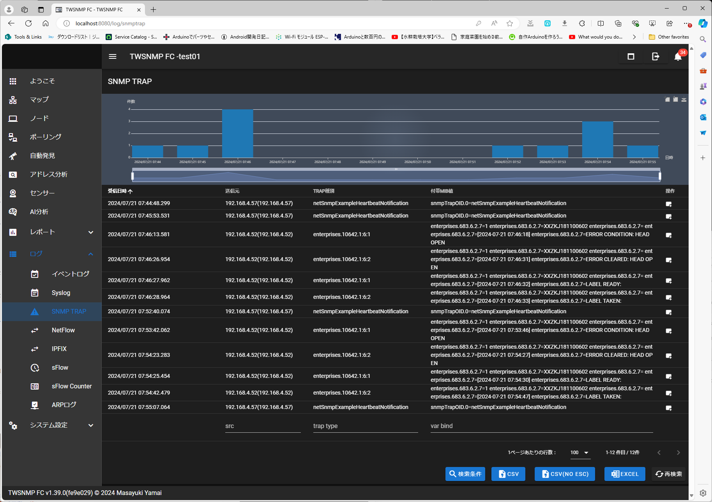

# Zebra-Printer_Link-OS_Get-Host-Status-by SNMP
# SNMPを用いてプリンタのホストステータスを取得する方法


</br>
</br>

## ■ SNMPとは

SNMPとはネットワーク上の機器を監視・管理するために開発されたプロトコル。
機器の遠隔マネジメントや多数機器の集中管理の目的で利用されることが多い。
ポーリング方式とトラップ方式が存在する。
</br>

- クエリー型


- 通知型


  [引用： 東陽テクニカ ネットワーク監視に必須！SNMPとMIBとは？](https://www.toyo.co.jp/onetech_blog/articles/detail/id=38080)

</br>
</br>

プリンタのOIDを解析するにあたって、MIBが必要な場合は下記を参考に入出すること。

### プリンタの MIB 入手方法

1. 製品サポートページからダウンロード
2. 実機から取得

   [ Zebra.com: Creating an SNMP MIB File on a QLn Printer Using Zebra Setup Utilities](https://supportcommunity.zebra.com/s/article/Creating-an-SNMP-MIB-File-on-a-QLn-Printer-using-Zebra-Setup-Utilities?language=en_US)

</br>
</br>

## ■ 1. SNMP ポーリング

問い合わせにより、ステータス・パラメータ値の取得が可能。

</br>

```
# 例、ピールセンサーの値を取得

# テイクアップ待ち
pi@raspberrypi0:/etc/snmp $ snmpwalk -v 2c -c public 192.168.4.52 iso.3.6.1.4.1.10642.15.1.4
iso.3.6.1.4.1.10642.15.1.4.0 = INTEGER: 0 ★

# テイクアップ後
pi@raspberrypi0:/etc/snmp $ snmpwalk -v 2c -c public 192.168.4.52 iso.3.6.1.4.1.10642.15.1.4
iso.3.6.1.4.1.10642.15.1.4.0 = INTEGER: 107 ★
```

</br>
</br>

##### 参考：ZEBRA-Link-OS_6.7_Vxx_20_25.mib

OID "iso.3.6.1.4.1.10642.15.1.4" はピーラーのセンサー値

```
--ZEBRA-MIB { iso org(3) dod(6) internet(1) private(4) enterprises(1) 10642 }
zbrSensor                            OBJECT IDENTIFIER ::= { zebra 15 }
zbrSensorPeel                        OBJECT IDENTIFIER ::= { zbrSensor 1 }
zbrSensorPeelCurrent OBJECT-TYPE
    SYNTAX INTEGER
    ACCESS read-only
    STATUS mandatory
    DESCRIPTION
    "Peeler Sensor current value"
    ::= { zbrSensorPeel 4 }
```


##### MIB の入手方法は２つ

1. 製品サポートページからダウンロード
2. 実機で生成
   [Suppport Community: Creating an SNMP MIB File on a QLn Printer Using Zebra Setup Utilities](https://supportcommunity.zebra.com/s/article/Creating-an-SNMP-MIB-File-on-a-QLn-Printer-using-Zebra-Setup-Utilities?language=en_US)

</br>
</br>

## ■ 2. SNMP Trap

SNMP Trap機能を用いると対象ホストにイベント通知が可能。

</br>

### 設定

```
! U1 setvar "alerts.add" "ALL MESSAGES,SNMP,Y,Y,255.255.255.255,0,N,"
! U1 getvar "alerts.configured"
"ALL MESSAGES,SNMP,Y,Y,255.255.255.255,0,N,"
```

</br>

### SNMP Manager 側でTRAP 通知を受信可能

図：TWSNMP FC(Windows) を用いてTRAPを受信



[参考: TWSNMP] (https://lhx98.linkclub.jp/twise.co.jp/)

